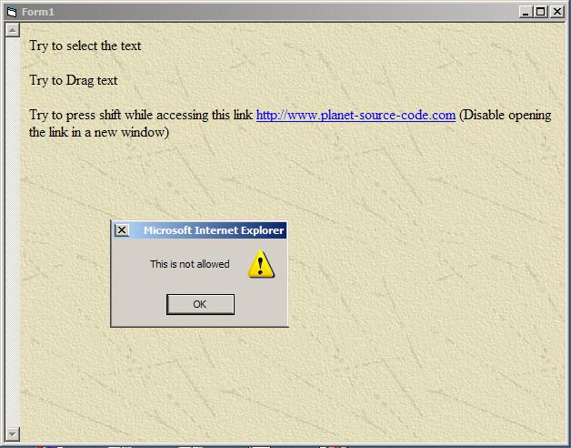

## Disable unwanted events from the WebBrowser Control

### Description

This demo project disables Right-Click, Text Selection, and Text Drag from the WebBrowser control. I needed to find/adjust this code to hide my page source path and contents. Well I 've been benefeting from all the other good submissions, and I think that it is my turn now to try to upload something useful to others. I hope I can get your votes for this submission.
 
### More Info
 
Just paste the following after the </head> in your html file

&lt;script src="nrc.js"></script>

&lt;script src="noshift.js"></script>

&lt;body background="your background image" ondragstart="return false" onselectstart="return false">

             |
---                |---
**Submitted On**   |2004-09-08 17:59:16
**By**             |[Hilal](https://github.com/Planet-Source-Code/PSCIndex/blob/master/ByAuthor/hilal.md)
**Level**          |Advanced
**User Rating**    |4.2 (21 globes from 5 users)
**Compatibility**  |VB 6\.0, VB Script
**Category**       |[Internet/ HTML](https://github.com/Planet-Source-Code/PSCIndex/blob/master/ByCategory/internet-html__1-34.md)
**World**          |[Visual Basic](https://github.com/Planet-Source-Code/PSCIndex/blob/master/ByWorld/visual-basic.md)
**Archive File**   |[Disable\_un1796179212004\.zip](https://github.com/Planet-Source-Code/hilal-disable-unwanted-events-from-the-webbrowser-control__1-56287/archive/master.zip)

